# angrybirds2-arena-hack
Do not wait anymore for arena tickets: works on iPad, iPhone and Android !

Available here on Dockerhub: https://hub.docker.com/r/fenyoa/angrybirds2-arena-hack/

* Configuration and usage *

In the Wi-Fi settings: 
set the proxy to the host on which you have launched the Docker container; 
set the port to the one the container is listening (8080).
 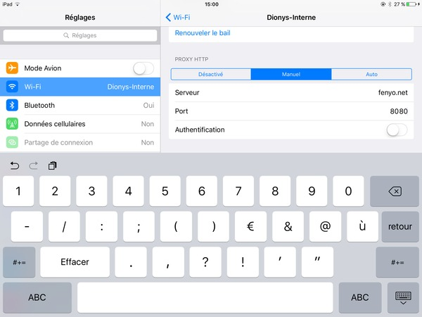

Run Safari and connect to <b>http://my.hack/</b>
 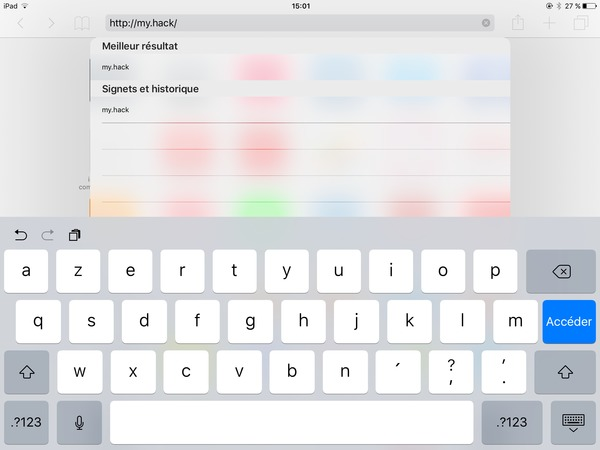

You should see the following page:
 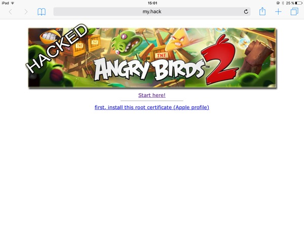

Click on "First, install...". You should then get this dialog:
 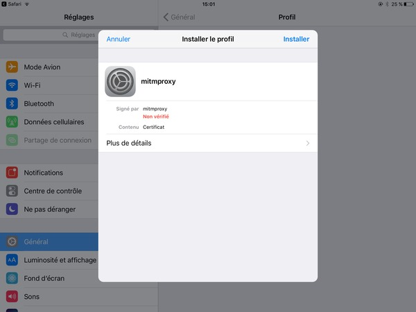

Click on "Install". You should then get this dialog:
 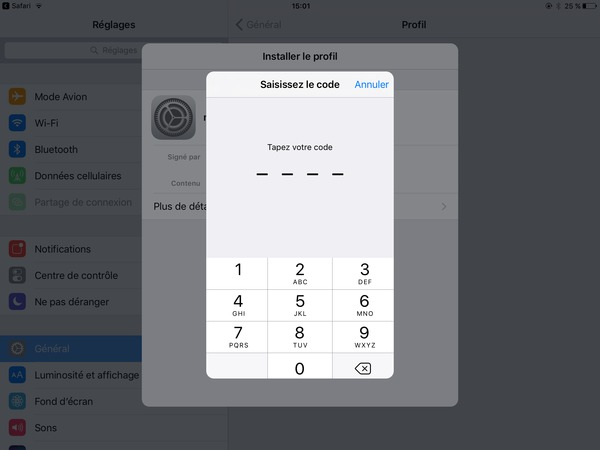

Enter you PIN code. You should then get this dialog:
 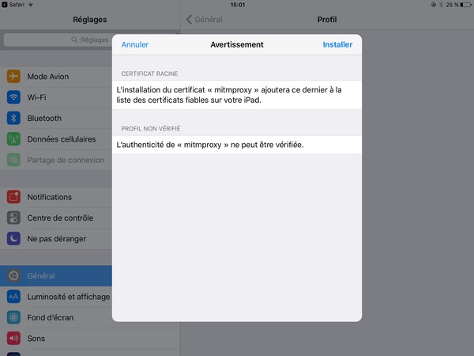

Click on Install. You should then get this dialog:
 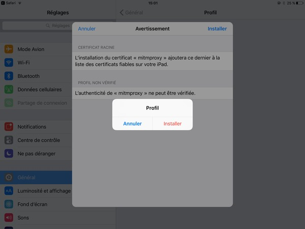

Click on Install. You should then get this dialog:
 

Wait a few seconds doing nothing. You should then see:
 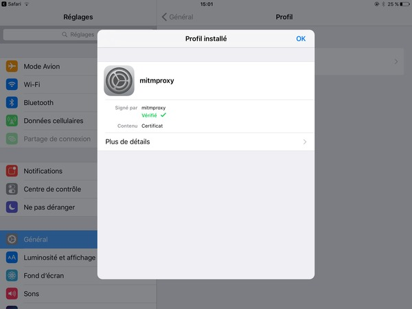

Click on OK to return to Safari:
 

Click on "Start here!":
 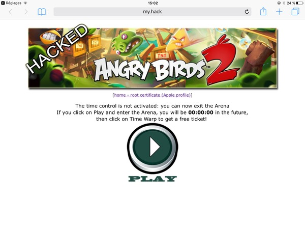

Launch Angry Birds 2 and enter the Arena:
 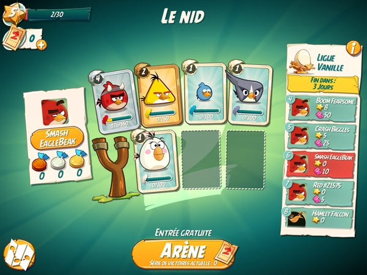

Play until you need to wait 3 hours to get a free ticket:
 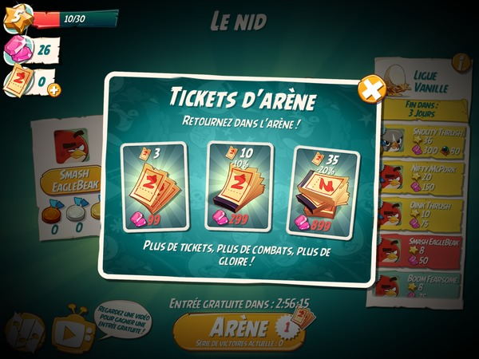

Come back to Safari:
 

NOW, YOU NEED TO ACTIVATE THE <B>TIME CONTROL</B>. CLICK PLAY TO GO TO THIS PAGE:
 

The time control lets you jump into the future, one hour by one hour. 
So, click 2 times on the Time Warp button, to fast forward 2 hours in the future:
 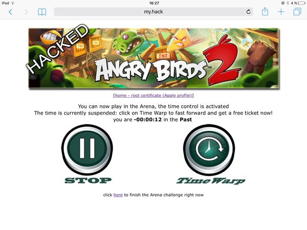

Click on Arena and look at the time left. It should be about 1 hour now:
 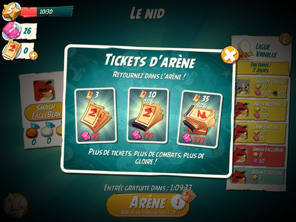

      
Click a third time on Time Warp and click on Arena even if no free ticket seems to be provided. 
It will give you a free ticket:
 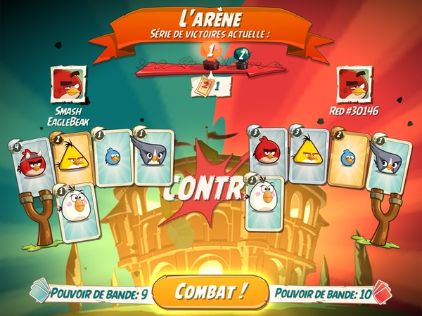

Play the game until you are the first in the Arena. It should be easy at the beginning of the week. 
Then finish the contest by jumping 1 week into the future. 
To do this, just come back to Safari and click on "click <b>here</b> to finish...":
 

Now come back to Angry Birds 2, get all the gifts and enter a new league!
 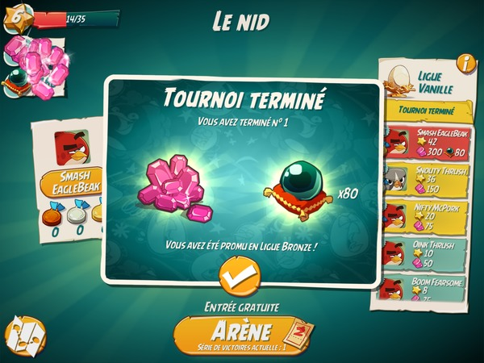

Back to Safari:
 

To come back in the present, click on Stop:
 

Now, you can exit the Arena and play levels. 
The hack continues to run but it does not change the real time.

<b>Whenever you want to enter the Arena again, do not forget to click on Play.</b>
